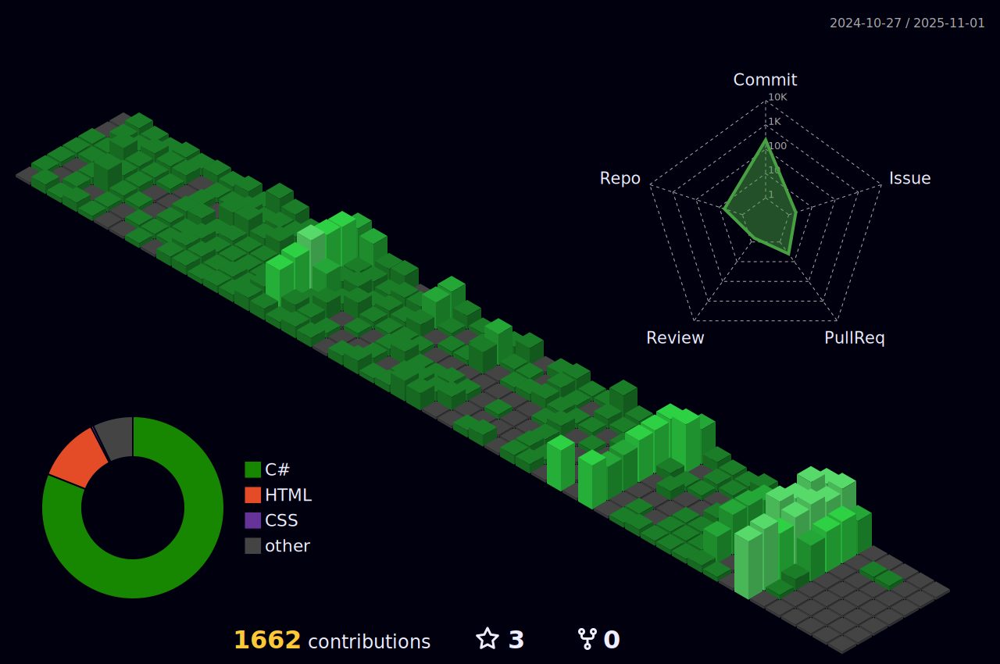

# **Olá!**

Meu nome é **Humberto Guedes**, sou um **Desenvolvedor .NET** com experiência em **desenvolvimento web** e **desktop**, especializado na manutenção e evolução de sistemas com **.NET**.

## **Resumo**

- Software Developer
- Game Developer
- Certificado em C#
- Atualmente Trabalhando com: **.NET**, **Razor** e **React**

## **Contato**

  
  

## **Stack Web**

## **Stack Game-Dev**

#

#

  

